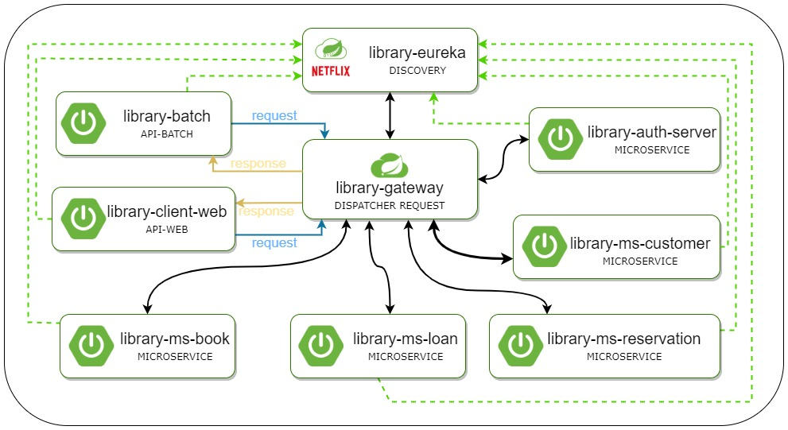

# LIBRARY-OC-P10

# Projet réalisé dans le cadre de la formation Développeur d'application JAVA OpenClassrooms.

	Ajout d'une fonctionnalité de réservation à un site de gestion de bibliothèque de la ville.

# Contexte :

Au sein de la Direction du Système d’Information (DSI) de la mairie d’une grande ville, nous avons développé le site
de gestion de la bibliothèque d'OCland.
Le directeur du service culturel nous demande l'ajout d'une fonctionnalité de réservation.
Durant le développement de la nouvelle fonctionnalité, nous avons dû corriger un bug de l'application.
Linda, la tech lead, nous a demandé la mise en place de tests pour la nouvelle fonctionnalité.

## Le projet :

Les différents repository du projet sont consultables à l'adresse suivante : https://github.com/LIBRARY-OC-P10

**La foncionnalité "réservation"** 
Le but est de permettre aux usagers de réserver un livre.
Les règles de gestions sont les suivantes :

* RG1 : La liste de réservation ne peut comporter qu’un maximum de personnes correspondant à 2x le nombre d’exemplaires de l’ouvrage.
* RG2 : Il n’est pas possible pour un usager de réserver un ouvrage qu’il a déjà en cours d’emprunt.
* RG3 : Quand un usager emprunte le livre réservé ou si le délai de 48h après la notification est dépassé, sa réservation est supprimée de la liste et le processus recommence pour l’usager suivant dans la liste.
* RG4 : Lors de la recherche d’ouvrage, pour ceux indisponibles, il doit y avoir la date de retour prévue la plus proche et le nombre de personnes ayant réservé l’ouvrage. Si la liste d’attente de l’ouvrage n’est pas complète, il doit pouvoir demander une réservation. Il sera alors ajouté à la liste d’attente.
* RG5 : L’usager doit pouvoir avoir une liste des réservations qu’il a en cours avec pour chaque ouvrage la prochaine date de retour prévue et sa position dans la liste d’attente.
* RG6 : L’usager doit pouvoir annuler une réservation.

	
## L'architecture de l'application
L'architecture a été modifié pour intégrer un nouveau microservice.

	
## Les contraintes fonctionnelles

	- Application web avec un framework MVC.
	- API web en REST (Les clients (site web, batch) communiqueront avec cette API web) 
		-> factorisation de la logique métier.
	- Packaging avec Maven.
	
## Développement

	Cette application a été développé avec :
	- Intellij IDEA
	- Java 8 (version 1.8u241)
	- Tomcat 9
	- PostgreSQL 11 (version 11.5.2)
	- le framework Spring (version 5.2.1)
	- Spring boot
	- LOMBOK
	- Spring DATA JPA
	
## Déploiement

1- Importez tous les microservices du repository.

2- Créez une base de données pour chaque microservice. Les scripts sont dans le dossier "scripts DB".
Vous devez modifier les propriétés de la datasource dans chaque fichier "application.properties" de chaque
microservice (dans src/main/resources/).

3- Pour lancer l'application : démarrez "library-eureka" en premier.

Dans votre navigateur, vous pourrez accéder au site à l'addresse localhost:8080, si vous n'avez pas modifié
les propriétés "server.port".

## Auteur

M.COZ